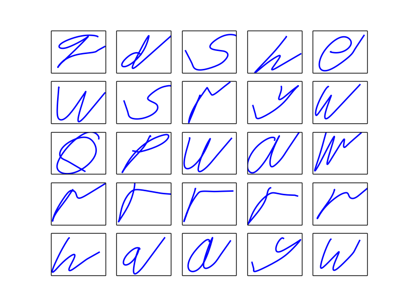
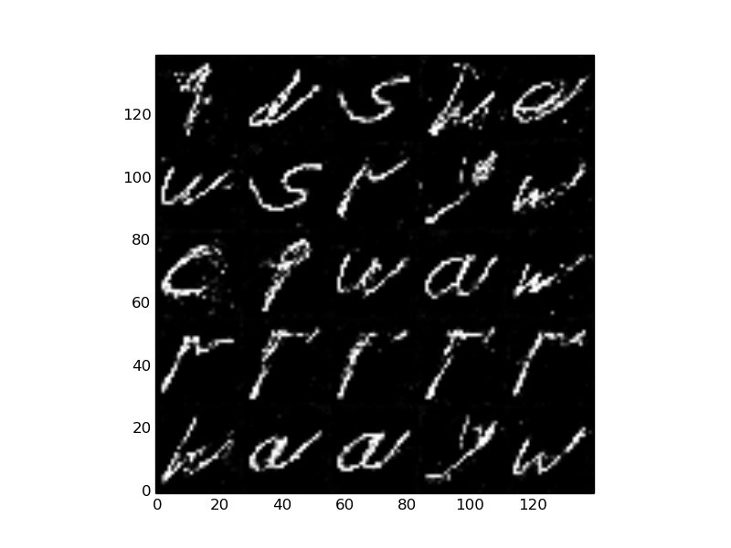
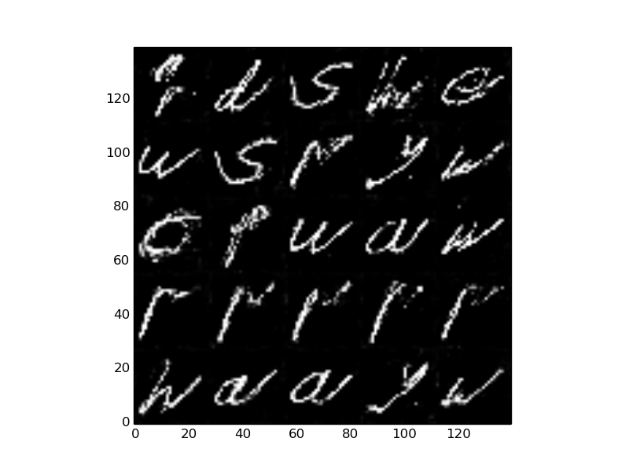
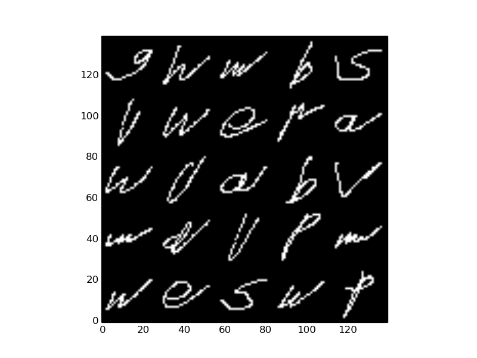
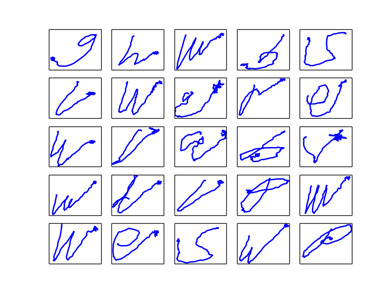
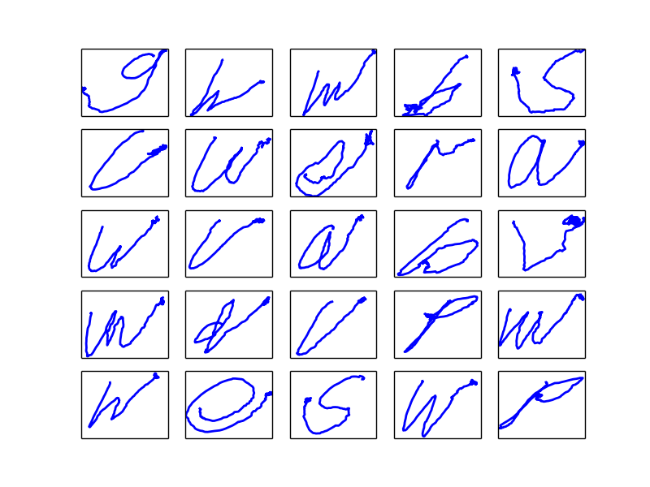
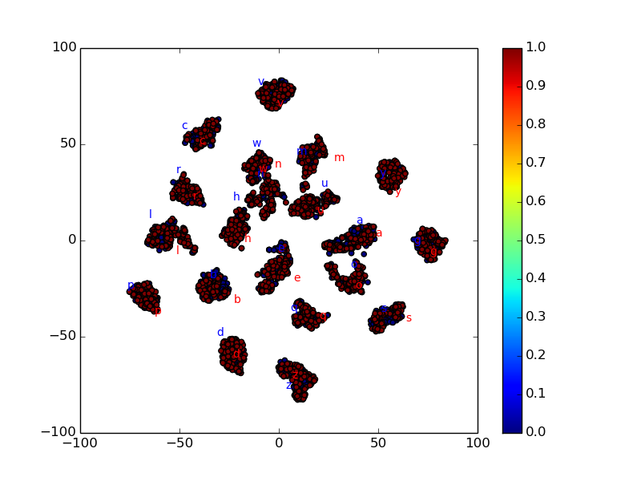
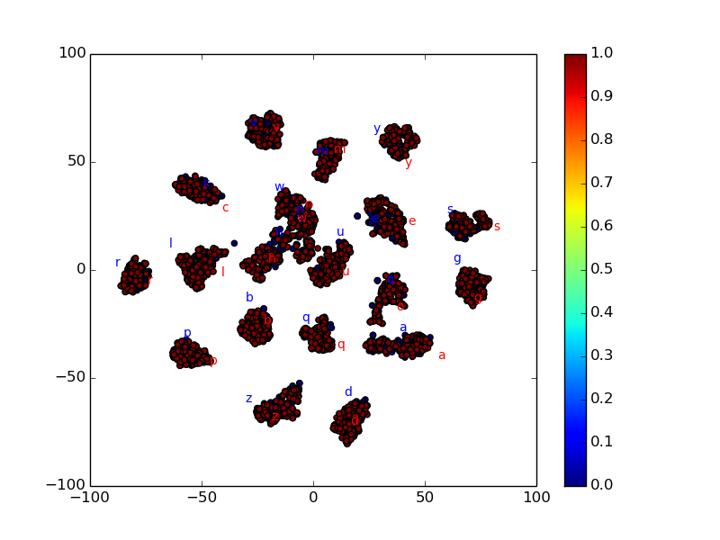

# Unsupervised Timeseries To Images

1. This repo realizes `bi-directional translation` between temporal sequences and images. 
2. It's kind of domain transfer or semantic style transfer. 
3. It requires no paired training sample.

# Environment

1. Tensorflow-1.7
2. Python-2.7

# Project Structure

1. `cyclegan`. codes for cyclegan, unfortunately it doesn't work here.
2. `figs`. pictures.
3. `saegan`. codes for saegan and svaegan.
4. `datamanager.py`. a data-loader for batch training.
5. `dataprepare.py`. prepare images data.
6. `utils.py`. some tools.

# Dataset

We conduct experiments on [CharacterTrajectories](http://timeseriesclassification.com/description.php?Dataset=CharacterTrajectories).

1. Sequence. The `CharacterTrajectories` itself is a dataset of temporal sequences.
2. Images. We plot the coordinates on x-y plane, see `dataprepare.py`.

# Networks

1. saegan (Symmetric Auto-Encoder GAN)
2. svaegan (Symmetric Variational Auto-Encoder GAN)

Please refer to [here](https://github.com/SongDark/domain_transfer_mnist) for more details.

# Results

## Sequence to Image

| *real sequence* | *converted by saegan* | *converted by svaegan* |
| :---: | :---: | :---: |
|  |  |  |

## Image to Sequence

| *real image* | *converted by saegan* | *converted by svaegan* |
| :---: | :---: | :---: |
|  |  |  |

## t-SNE visualization

Here we visualize the latent space through t-SNE.

| *saegan* | *svaegan* |
| :---: | :---: |
|  |  | 